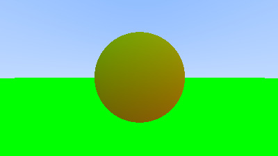
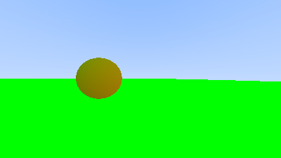
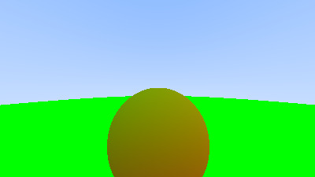
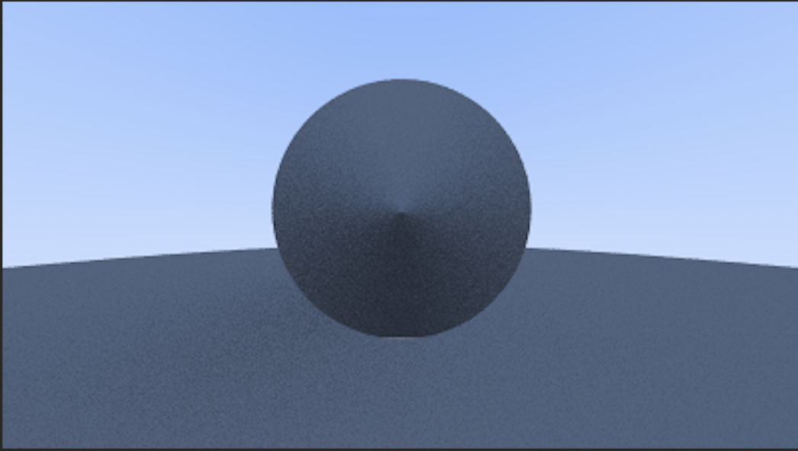

# Raytracing Renderer
Mateos Norian, Krishna Suresh, Merwan Yeditha

## Goal 

We want to code a raytracing engine/3D renderer using Cuda and C using WebAssembly so that the app can be run through a browser while using local resources. Our MVP would be to be able to ray trace for a fixed frame. A more stretch goal would be to somehow customize the scene that we are rendering (being able to place different types of objects, change position of light, add more light sources). 

## Learning Goals

* Understanding Cuda
* Gaining exposure to basic 3D graphics/rendering
* Learn about ray tracing
* Programming using GPU resources

## Resources

- https://cal.cs.umbc.edu/Courses/CMSC435-F15/Slides/raytrace.pdf
- https://github.com/RayTracing/raytracing.github.io
- https://www.nersc.gov/assets/pubs_presos/MattsonTutorialSC14.pdf

## Project Progress

Our team achieved:
* Generating a PPM image
* Implementing collision detection
* Computing basic color calculation at collision point
* Implemented light diffusion calculation


### Some example images generated (converted to JPEG)
Demonstrations of images generated with different camera angles.


*Image 1*


*Image 2*


*Image 3*


One of the design decisions we faced was with the type of image we wanted to render. We chose to only attempt to display spheres as the surface normals for a sphere is far easier to calculate when compared with a more complex geometry. 


```c-like
float hit_sphere(Ray* r, Vec3* center, float rad){
    Vec3 oc = {r->orig.x-center->x, r->orig.y-center->y, r->orig.x-center->z};
    op_vecs(r->orig, *center, 2);  
    float a = dot(r->dir, r->dir);
    float b = 2.0 * dot(oc, r->dir);
    float c = dot(oc, oc) - rad*rad;
    //printf("params: %f %f %f\n", oc.x,oc.y,oc.z);
    float disc = b*b-4*a*c;

    if (disc<0){
        return -1.0;
    } else {
        return (-b - sqrt(disc) ) / (2.0*a);
    }
}
```
One key element of the ray tracing algorithm is the detection of collisions between rays and objects in the scene. The `hit_sphere` function above calculates the intersections between the sphere and a ray by finding the roots to a quatratic equation. If no root is found we return -1 and if a root is found, the magnitude of the vector along the ray where the intersection occurs is returned.

### Lambertian Spheres


*Attempt at Lambertian Sphere render*


## Reflections

We landed somewhere in between our lower and upper bound goals. We were able to successfully implement the basics of a renderer, and allowed for some user interactivity within the scene.

Our team definitely achieved our learning goals. We started the project with little to no understanding of ray tracing and image generation and by this report have successfully implemented and comprehend the basics of it.


## Audience

Our target audience is anyone interested in getting a low-level introduction to ray tracing and/or computer graphics. By looking through and understanding our code, readers should be able to implement components of a ray tracing alogorithm. 


 